# Aspect-Based Sentiment Analysis for Patient's Narrative

*by* **Vanilla Deep** ( Jianheng Hou, Zheng Cao, Jiasheng Wu, Yuang Liang )

## Introduction

### Background

As known to all, data science and analysis has brought innovation to the financial investment industry in recent years. The idea of this project came from venture capital (VC) field: partners in a firm wanted to leverage data science to extract insights hiding in the data on healthcare field. This is an innovative pipeline to dig out and monitor patient’s suffering, or say, issues in healthcare so to support investment decisions and strategy of VC firms. Moreover, this is a typical end-to-end Text Mining Project. Aspect-based sentiment analysis, as the main part of the project, was used to analyze the sentiment of patient’s narrative with different aspects we defined.

### Problem Statement

Different from traditional sentiment analysis, we analyze sentiment by different issue categories which are predicted by another model. 

  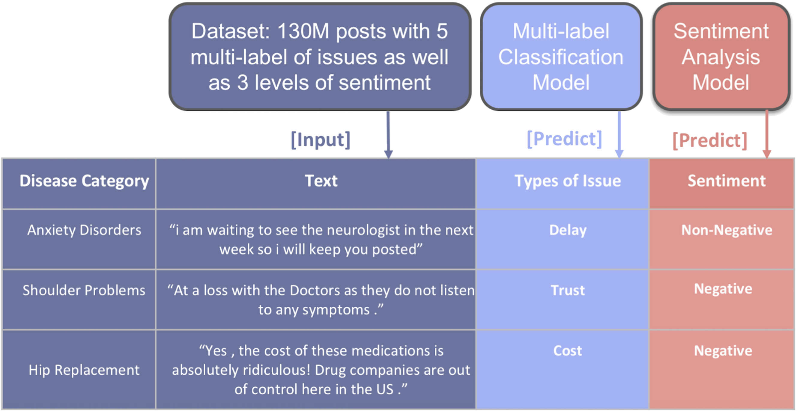
  <em>Problem Formulation</em>

Given each post of patient’s narrative, multi-label classification predicts what types of issues this post mentions. We defined 5 types of issues in healthcare I are interested. Then sentiment classification model predicts the sentiment of the post. We defined 2 different levels of sentiment, i.e. 1. Non-negative; 2. Negative. By this way, it is easier to know the sentiment distribution of tons of posts from different aspects that we defined.

### Challenges

The first challenge comes from the annotation. We collect data without labels from the biggest patient online forum ([patient.info](https://patient.info/)) in U.K and the U.S. We trained data with ground truth labeled by annotators in the market, so the performance of our model was limited to the quality of this data we collected. The second challenge is the high imbalance of the dataset we created, in which the data from the majority class occupies 87% of the whole data. Then, multi-label classification made our models hard to train, because insufficient minority data might not be learnt by models and the choosing of metrics for loss function and evaluation is a trick during training stage. To generate readable and intuitive visualization based on the output of models and to extract actionable insights from it is another challenge we faced.

## Pipeline

  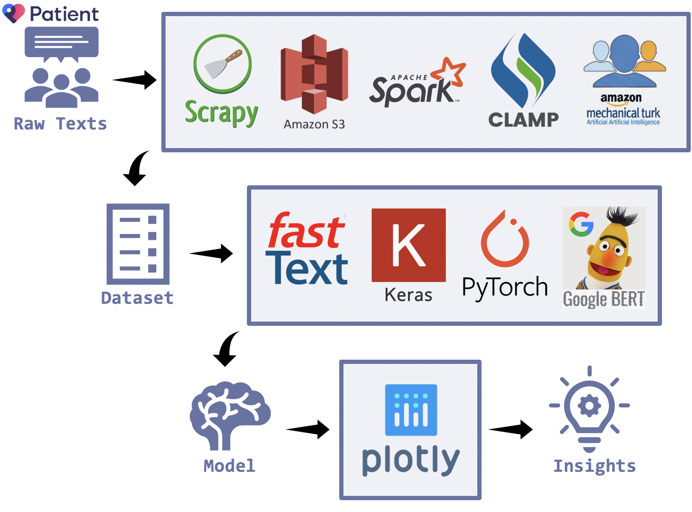
  <em>Pipeline</em>

The diagram above shows the whole pipeline of our end-to-end project, which includes data preparation, model training, visualization, and analysis. After crawling raw data (patient’s narrative posts) from the forum, we stored data in Amazon S3 and then followed by text processing using Spark. As our models are supervised based, we need to collect ground-truth label of the data, so we collect them through an online service, Amazon Mechanical Turk.  Entity recognition and relation recognition was done for feature engineering then. After generating and finalizing training dataset, models were built using deep learning frameworks: Keras and Pytorch. The model with the best performance was used to generate prediction results for the rest of all data other than training dataset, from which we got a list of meaningful and insightful insights via visualization and statistical analysis.

## Data Preparation

We used Scrapy to collect around 1.3 million patients’ narratives from the biggest patient online forum ([patient.info](https://patient.info/)) in U.K and the U.S. as our dataset. As it is a supervised learning task, we coded all labels we think are important in terms of investment perspective on our own, see table below. In order to annotate our data as quickly and accurately as possible, we designed a survey and sent them out to collect labels on Amazon Mechanical Turk. We embedded a sample of size 5,000 that annotated by our own in the survey with 50,000 posts we sent out to check the performance of workers.

  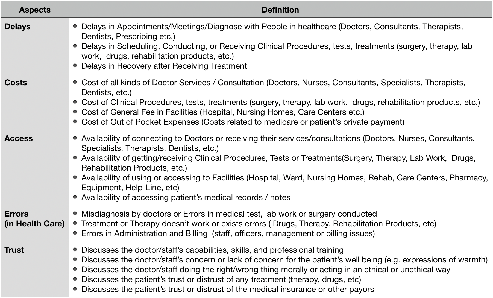
  <em>Code of Label for Ground-Truth</em>

Raw texts always contain wrong spelling, redundant punctuations, meaningless information. We filtered punctuations, extended contractions and abbreviations via dictionaries, parsed part of speech, made words lowercase, corrected spelling, and so on. All of these methods are beneficial to the performance of our models.

Features are important to both non-deep learning models and deep learning models. We use CLAMP toolkit to extract medical entities and relations in free text as features in non-deep learning models.

  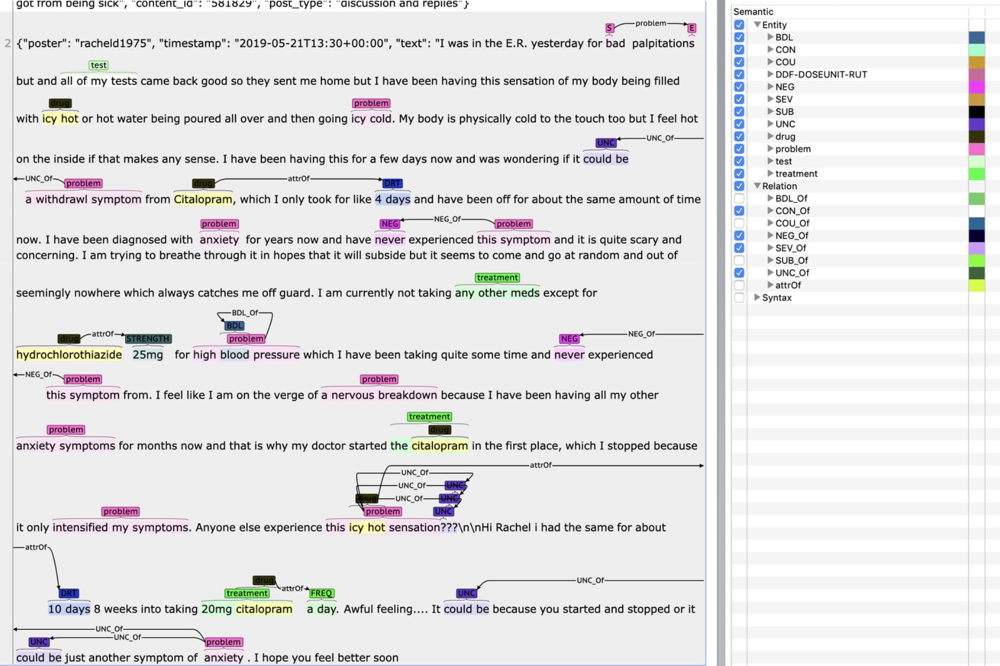
  <em>Entities and Relations Extraction using CLAMP</em>

## Model Training

We tried three different kinds of word embeddings: `FastText.300d` embedding (trained on this dataset) and other two popular pre-trained word embeddings, `glove.840B.300d` and `glove.twitter.27B`. It turned out our FastText embedding led to a better performance of models and we ascribed this to more domain-oriented clinical terminologies in the corpus. Below is the T-SNE visualization of the post embedding across 10 common disease topics. We do see some clusters, while the overall clustering effect was not as great as we expected due to noisy posts or general discussions.

  <em>(The following&nbsp;<a href="http://htmlpreview.github.io/?https://github.com/JiashengWu/Aspect-Based_Sentiment_Analysis/blob/master/fig/Top_10_Disease_Categories.html">interactive chart</a>&nbsp;may take some time to be loaded...)</em>

<iframe src="http://htmlpreview.github.io/?https://github.com/JiashengWu/Aspect-Based_Sentiment_Analysis/blob/master/fig/Top_10_Disease_Categories.html" width="1016px" height="766px">
  

    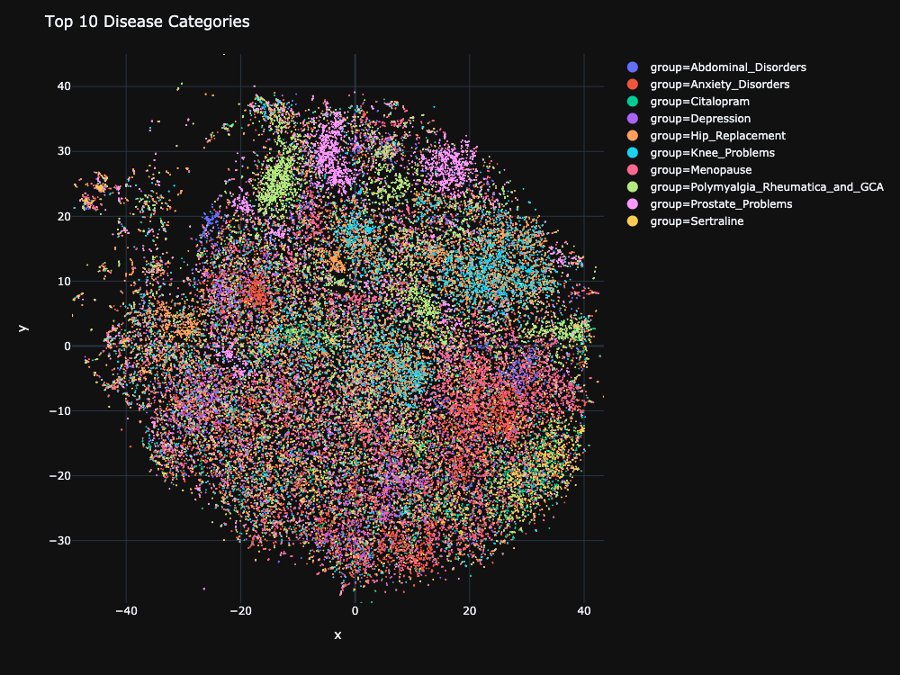
  

</iframe>

  <em>T-SNE Embedding of Top 10 Disease Categories</em>

We built an ensembled logistic regression and a neural network with three linear layers as the baseline following works and spent more time on 3 different types of deep learning models as below:

<table>
  <tr>
    <td>
      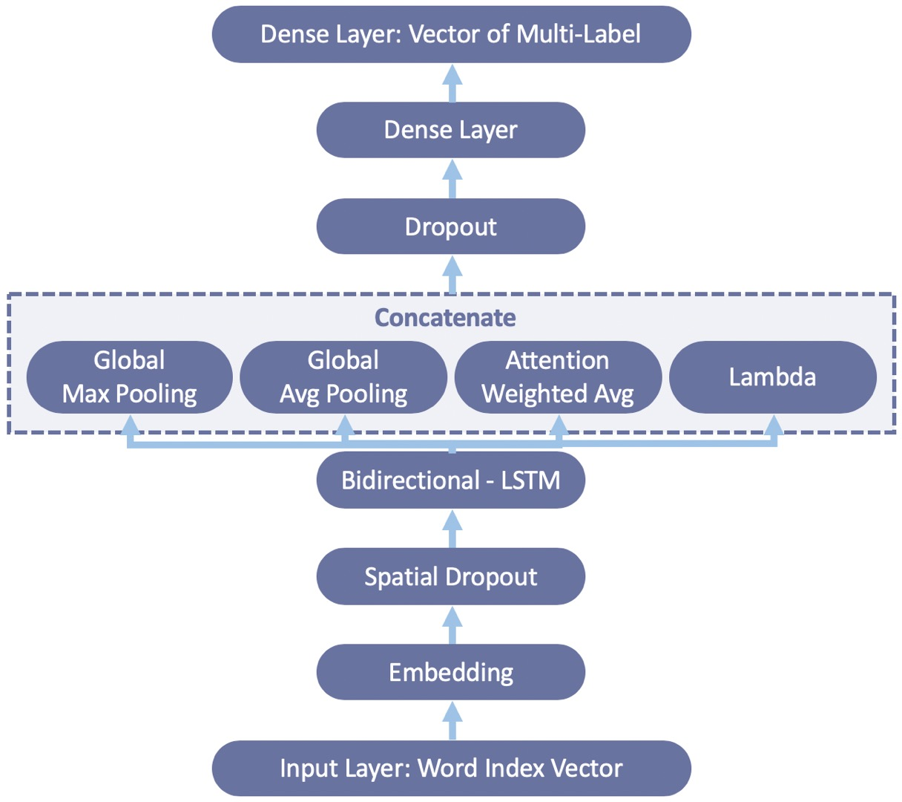
    </td>
    <td>
      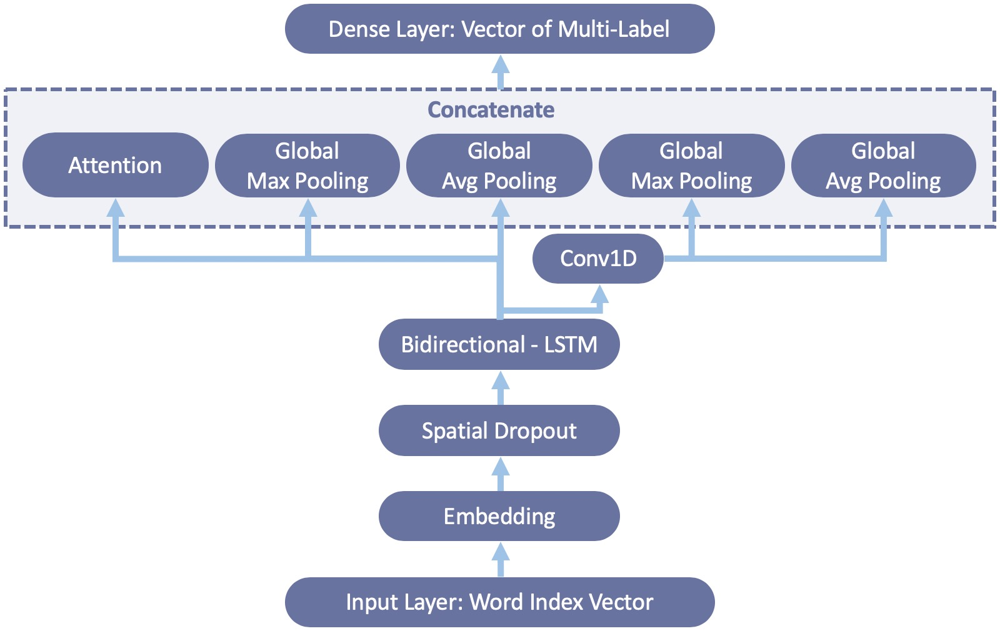
    </td>
    <td>
      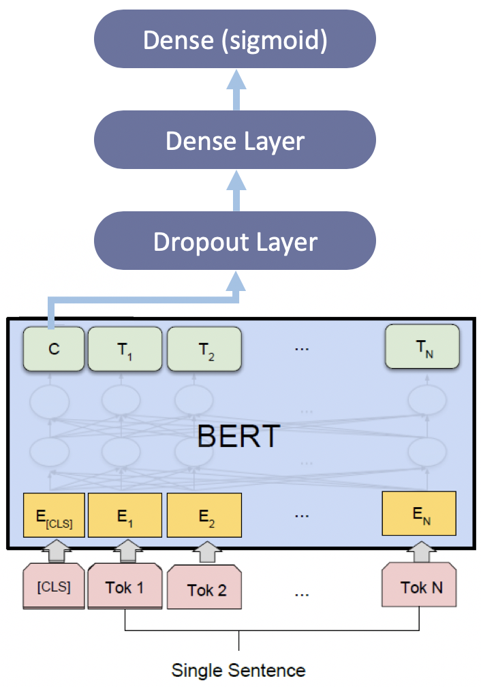
    </td>
  </tr>
  <tr>
    <td align="center">
      <em>Pooled RNN</em>
    </td>
    <td align="center">
      <em>Pooled RNN with TextCNN</em>
    </td>
    <td align="center">
      <em>BERT</em>
    </td>
  </tr>
</table>

After a bunch of experiments and model tuning, Pooled RNN (avg f1: 0.566) and BERT (avg f1: 0.557) led to better performance on the test set. As they caught different things as shown in the accuracy of all data and the accuracy of all data excluding data without any target labels, we ensembled them together to generate the best model that outerfromed than two below (avg f1: 0.571).

  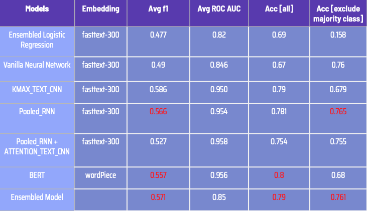
  <em>Evaluation of Models</em>

## Visualization

We generated a series of visualization diagrams to provide both visual and statistical results for gaining insights.

Below is a diagram where semantic meaning of posts colored by sentiment across 10 common diseases are represented as points on each sub-diagram. Not only can readers get a sense of how different topics distribute in semantic space, but also readers know the sentiment distribution of each disease so to compare among them.

  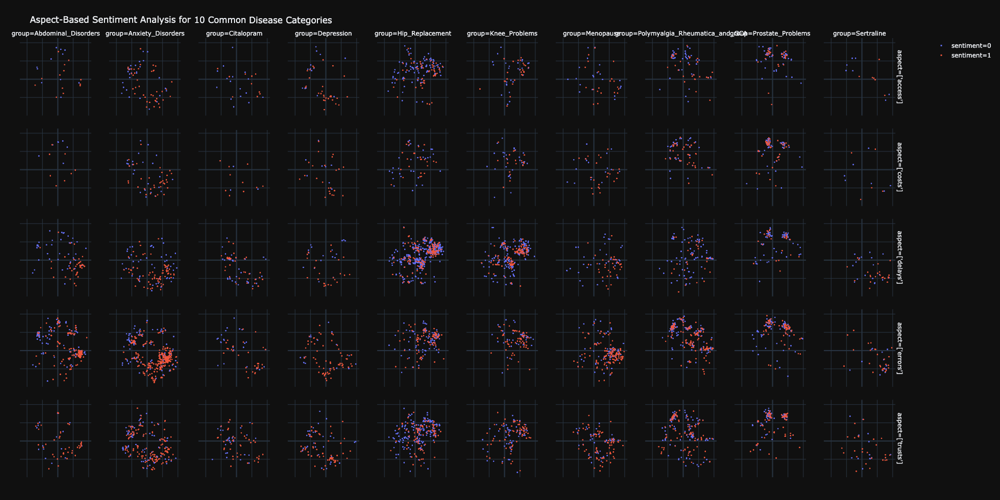
  <em>Aspect-Based Sentiment Analysis for 10 Common Disease Categories</em>

Another fancy diagram is to reveal the sentiment of individual disease topic posts on specific aspect in a statistical perspective.

  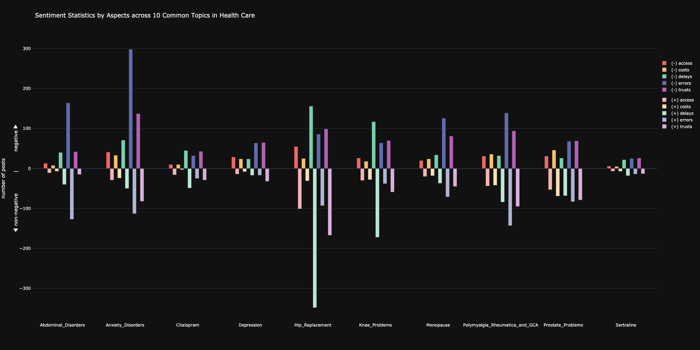
  <em>Sentiment Statistics by Aspects across 10 Common Topics in Health Care</em>

However, it is necessary to dive into the actual statistical numbers to identify diseases with specific serious issues we are interested. Diagrams below show the number of negative sentiment posts and the number of posts in both a global view and specific aspect view. We do extract some interesting insights from them.

<table>
  <tr>
    <td>
      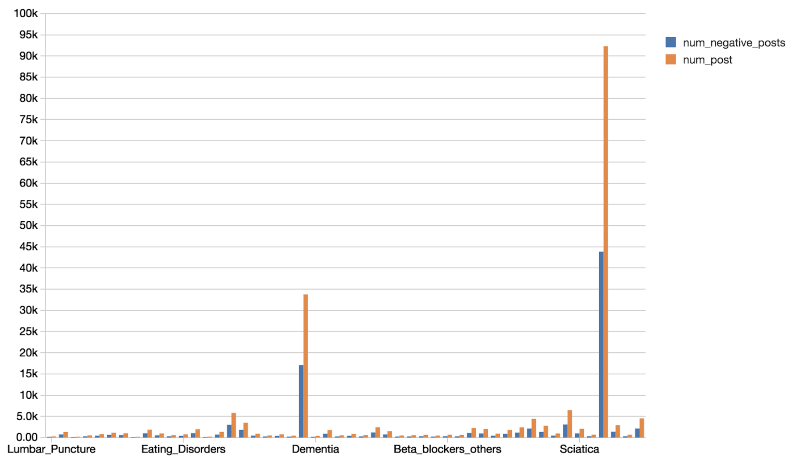
    </td>
    <td>
      
Top 3 Topics with <b>Negative Sentiment Rate</b>:

      

        <ul>
          <li>Lumbar Puncture</li>
          <li>Complex Regional Pain Syndrome</li>
          <li>Topiramate</li>
        </ul>
      

    </td>
  </tr>
  <tr>
    <td>
      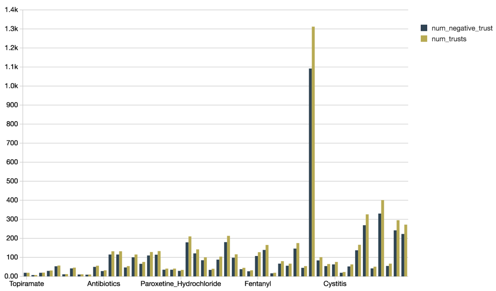
    </td>
    <td>
      
Top 3 Topics with <b>Bad Trust Issues</b>:

      

        <ul>
          <li>Topiramate</li>
          <li>Finger and Hand Problems</li>
          <li>Scabies</li>
        </ul>
      

    </td>
  </tr>
  <tr>
    <td>
      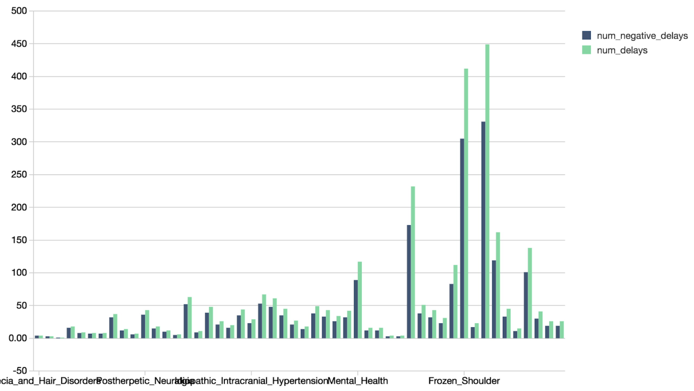
    </td>
    <td>
      
Top 3 Topics with <b>Bad Delay Issues</b>:

      

        <ul>
          <li>Alopecia and Hair Disorders</li>
          <li>Topiramate</li>
          <li>Pruritus Ani</li>
        </ul>
      

    </td>
  </tr>
  <tr>
    <td>
      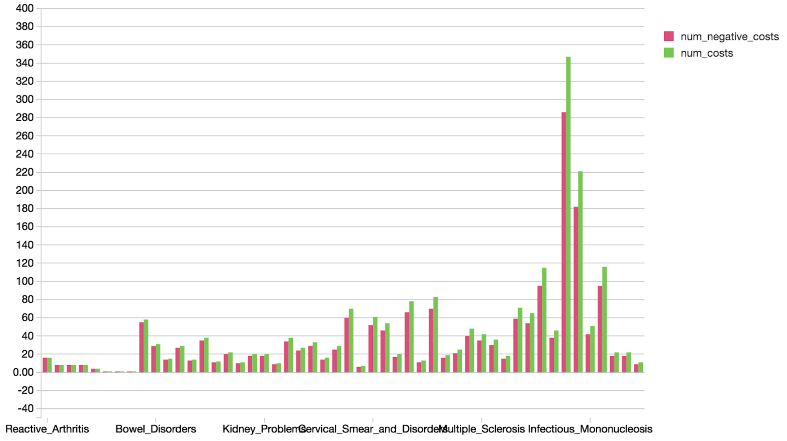
    </td>
    <td>
      
Top 3 Topics with <b>Bad Cost Issues</b>:

      

        <ul>
          <li>Reactive Arthritis</li>
          <li>Wegeners Granulomatosis</li>
          <li>Abscess Non dental</li>
        </ul>
      

    </td>
  </tr>
  <tr>
    <td>
      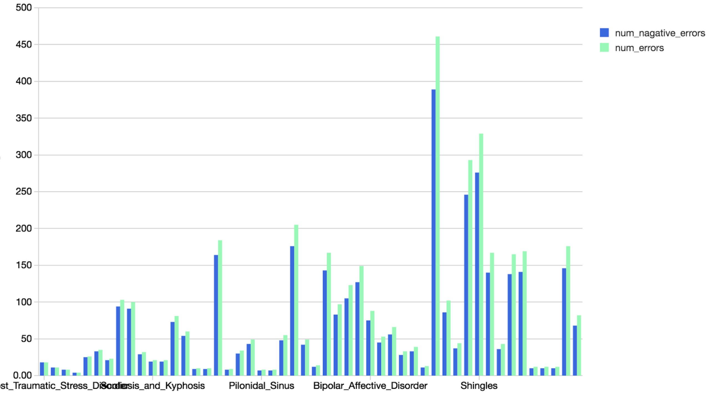
    </td>
    <td>
      
Top 3 Topics with <b>Bad Error Issues</b>:

      

        <ul>
          <li>PTSD Post Traumatic Stress Disorder</li>
          <li>Quetiapine</li>
          <li>Paroxetine Hydrochloride</li>
        </ul>
      

    </td>
  </tr>
  <tr>
    <td>
      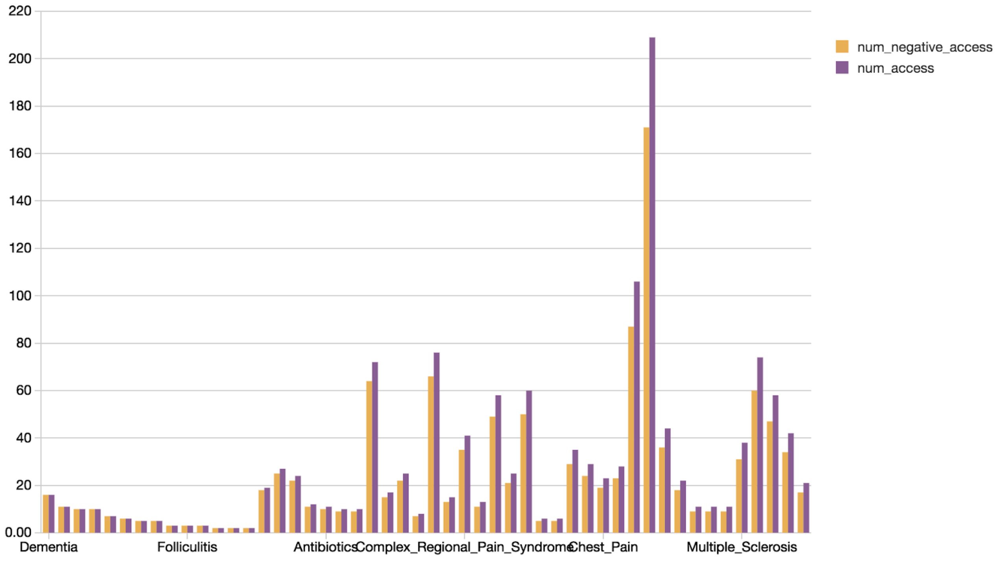
    </td>
    <td>
      
Top 3 Topics with <b>Bad Access Issues</b>:

      

        <ul>
          <li>Dementia</li>
          <li>Globus Sensation</li>
          <li>Pelvic Pain and Disorders</li>
        </ul>
      

    </td>
  </tr>
</table>

## References

1. [Humanizing Customer Complaints using NLP Algorithms](https://towardsdatascience.com/https-medium-com-vishalmorde-humanizing-customer-complaints-using-nlp-algorithms-64a820cef373)
2. [Deep Learning for Sentiment Analysis: A Survey](https://arxiv.org/pdf/1801.07883.pdf)
3. [Can I hear you? Sentiment Analysis on Medical Forums](https://pdfs.semanticscholar.org/1d6b/4edca519259c44307617f2b585ca27f1d4ad.pdf)

